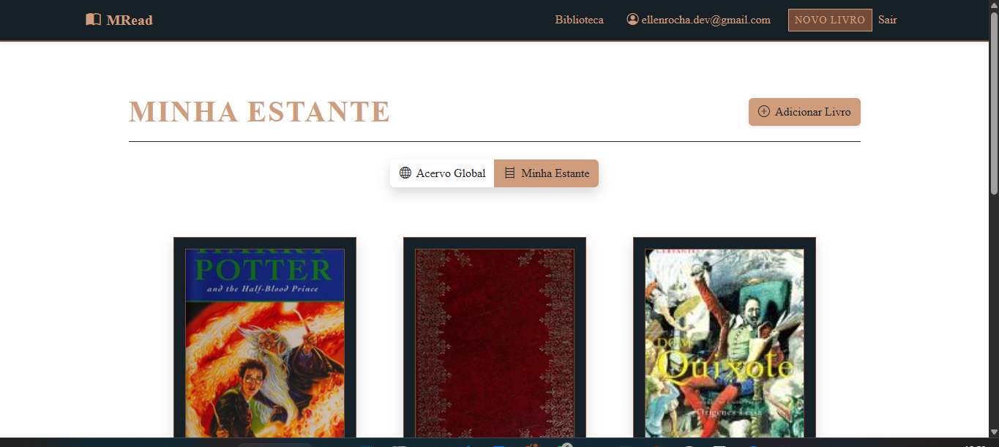

#  MRead

<div align="center">
  
</div>

O **MRead** é uma aplicação web desenvolvida em Ruby on Rails voltada para a organização e gerenciamento de estantes de leitura. O projeto utiliza uma arquitetura moderna baseada em Hotwire para oferecer uma experiência de navegação fluida, integrando-se à API da OpenLibrary para automação de metadados.

---

## 🏛️ Sobre o Sistema

O sistema foi estruturado para atender a requisitos de escalabilidade e separação de conceitos (SoC):

### Arquitetura de Busca
A comunicação com a API externa ocorre via backend através do `OpenLibraryService`, utilizando a biblioteca nativa `Net::HTTP` do Ruby para maior leveza.

### Interatividade Assíncrona
O frontend é gerenciado por **Stimulus JS**, que aplica técnicas de *debounce* para otimizar requisições à API, enquanto o **Turbo Frames** processa atualizações parciais de interface.

### Gestão de Dados
A persistência é realizada em **SQLite**, com autenticação robusta via **Devise**, permitindo que cada usuário gerencie exclusivamente sua própria coleção.

### Estética Visual
Utiliza o tema **Royal Dark**, com paleta de cores centralizada em variáveis CSS para garantir consistência visual em todos os componentes.

---

## 💻 Pré-requisitos

Antes de começar, verifique se você atende aos seguintes requisitos:

- Docker instalado (versão mais recente).
- Docker Compose instalado.
- Ambiente compatível com containers (Windows, Linux ou macOS).
- Conectividade com a internet para requisições à API da OpenLibrary.

---

## 🚀 Instalando o MRead

Para instalar e rodar o projeto via Docker (método recomendado), siga estas etapas:

### 1️⃣ Clone o repositório

```powershell
git clone <url-do-repositorio>
cd MRead
```

### 2️⃣ Suba os containers

```powershell
docker compose up --build
```

### 3️⃣ Prepare o banco de dados

```powershell
docker compose exec web rails db:prepare
```

---

## 📖 Usando o MRead

Acesse: `http://localhost:3000`

Caso a porta 3000 já esteja em uso, você pode alterar o mapeamento no docker-compose.yml (ex: '3001:3000') e acessar via localhost:3001.

### Autenticação

Crie uma conta ou faça login para acessar a área logada.

### Busca

Na página de cadastro, informe o título de um livro. O sistema exibirá os resultados da OpenLibrary em tempo real via Turbo Frame.

### Persistência

Ao selecionar um exemplar, o sistema captura automaticamente:

- Autor
- Ano de publicação
- ISBN
- Capa

Esses dados são salvos em sua estante particular.

### Escopo

Alterne entre:

- Acervo Comunitário
- Minha Estante

para gerenciar seus registros pessoais.

---

## Política de Uso de IA

O uso de assistentes de IA (Gemini/ChatGPT) foi adotado como colaborador técnico para auxiliar na arquitetura e acelerar o desenvolvimento de componentes específicos.

---

## Exemplos de Erros e Correções Técnicas

### 1️⃣ Validação de ISBN (NoMethodError)

**Cenário:**
A IA sugeriu uma lógica de validação de ISBN usando `.match?` diretamente em uma variável que retornava `nil` em buscas vazias.

**Correção:**
Implementei:

- Conversão explícita para string (`.to_s`)
- Uso de `.blank?`
- Validação via Regex somente após sanitização
- Garantindo robustez no fluxo

### 2️⃣ Fluxo de Redirecionamento e Turbo Frames

**Cenário:**
O redirecionamento sugerido após a seleção do livro causava o erro "No content missing", pois o Rails tentava carregar a Home dentro do frame de busca.

**Correção:**
Forcei a saída do contexto do Turbo Frame usando:

```ruby
data: { turbo: false }
```

Garantindo redirecionamento de página inteira.

### 3️⃣ Sincronização de Feedback Visual (Spinner)

**Cenário:**
Controle de loading manual via JS poderia travar o spinner caso a requisição terminasse de forma inesperada.

**Correção:**
Integrei o Stimulus aos eventos nativos do Turbo (`turbo:frame-load`), sincronizando a interface diretamente com a resposta do servidor.

---

## 👥 Colaborador(es):

<table>
  <tr>
    <td align="center">
      <a href="https://github.com/EllenRocha1" title="Perfil no GitHub">
        
        <br/>
        <sub>
          <b> Ellen Rocha </b>
        </sub>
      </a>
    </td>
  </tr>
</table>
